# Integrating Visible Light for Enhanced Thermal Imaging: Parameterized Scene-Based Non-Uniformity Correction

This paper introduces a deep learning based Non-Uniformity Correction (NUC) method to model non-uniformities in thermal imagery with auxiliary guidance from corresponding visible-light images. Unlike many other traditional denoising techniques that strive to directly estimate clean images, our approach emphasizes linear non uniformity parameter estimation of inherent noise, allowing real-time application of the denoising process. The proposed method utilizes a dual-network architecture comprising an infrared estimator and a noise estimator. The infrared estimator merges information from both noisy infrared and visible camera images to predict the clean infrared image. Simultaneously, the noise estimator calculates the non-uniformity noise parameters using a dataset of clean and noisy infrared images. This methodology not only reduces the computational burden by eliminating the need for extensive per-image processing but also significantly improves the quality of thermal images. We assessed our model's performance on a comprehensive dataset, comparing it with recent methods such as DLS-NUC, D1WLS, and Multiview-FPN, and achieved superior results across various metrics.

| Noisy                                        | DLS-NUC                                       | D1WLS                                        | MultiViewFPN                                     | Ours                                         |
|----------------------------------------------|-----------------------------------------------|----------------------------------------------|--------------------------------------------------|----------------------------------------------|
| 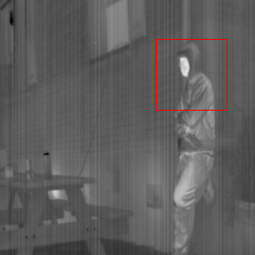 |  | 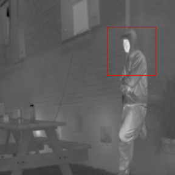 |  | 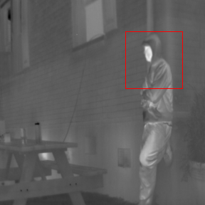 |
| 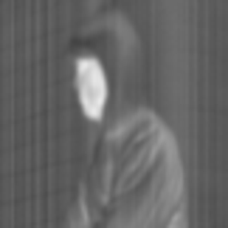 | 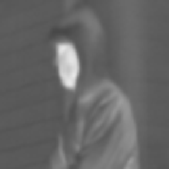 | 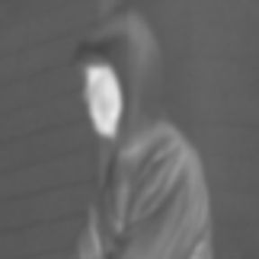 | 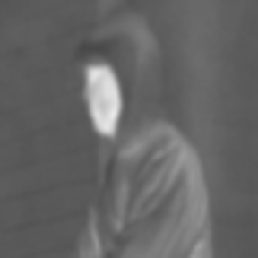 | 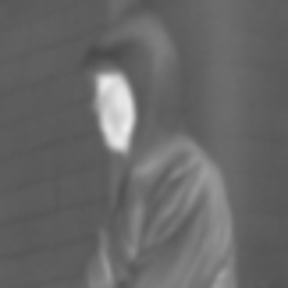 |
|  |  | 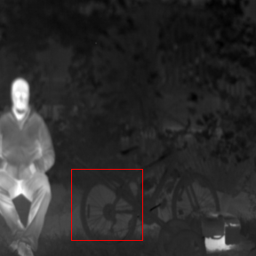 | 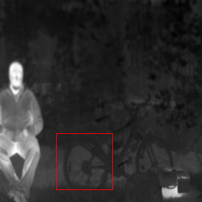 | 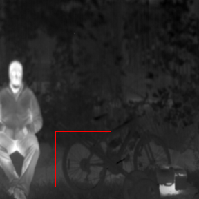 |
| 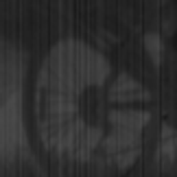 |  |  | 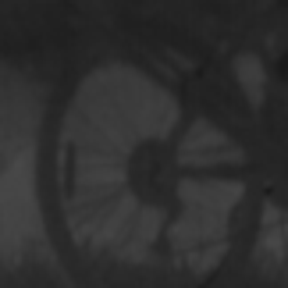 |  |

>> Submitted to MLSP 2024
>> 2024 IEEE International Workshop on Machine Learning for Signal Processing
>> Date: 22-25 September 2024
>> Location: London, UK